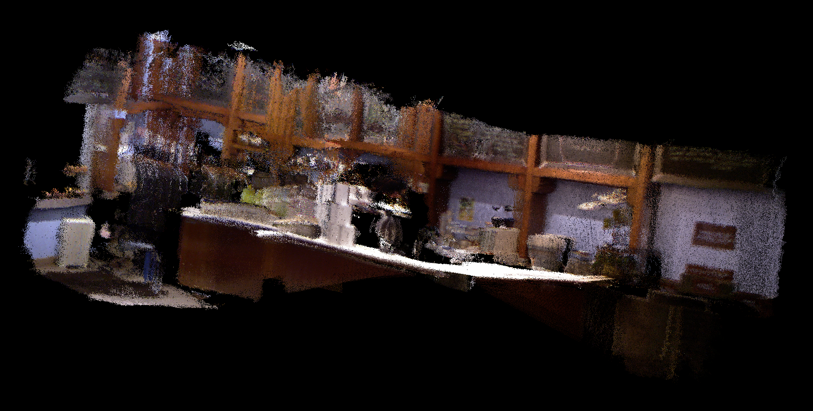

# rgbd-slam-practice

### Overview
This project is related to RGB-D SLAM (**S**imultaneous **L**ocalization **A**nd **M**apping). It is only a small practice for me to go through the entire pipeline of keypoint-based visual SLAM and to pick up my C++ programming. **The code largely depends on this [tutorial](http://www.cnblogs.com/gaoxiang12/tag/%E4%B8%80%E8%B5%B7%E5%81%9ARGB-D%20SLAM/)**.

### Prerequisite
- [g2o](https://github.com/RainerKuemmerle/g2o): I encountered several problems with this library and I have modified it a bit. The one works well is in ```3rdparty/``` directory. What I've done in my uploaded g2o package are,
```
$ git clone -b c++03 https://github.com/felixendres/g2o.git
  # add “add_compile_options(-std=c++11)” to CMakeLists.txt
$ cd g2o
$ mkdir build && cd build
$ cmake .. -DG2O_BUILD_EXAMPLES=OFF
$ make -j4
```
- [PCL](https://github.com/PointCloudLibrary/pcl): For Ubuntu 16.04, you can directly install it using ```sudo apt-get install libpcl-dev pcl-tools```. Otherwise, you can [build it from source](https://larrylisky.com/2016/11/03/point-cloud-library-on-ubuntu-16-04-lts/).
- [OpenCV](https://github.com/opencv/opencv/releases): Remember to check the version being used in ```CMakeLists.txt```.

### How to Run
Build the code,
```
$ cd ${RGBD-SLAM-PRACTICE-ROOT_DIR}/build
$ cmake ..
$ make
```
A set of RGB and depth images are required for RBGD-SLAM. Normally, a pair of RGB and depth images should have the same name but are placed in ```./data/rgb_img``` and ```./data/depth_img``` directories resepectively. The images in a directory will be read in numerical order of the filenames. There are several adjustable parameters specified in ```parameters.txt```.
Run the code,
```
$ cd ${RGBD-SLAM-PRACTICE-ROOT_DIR}
$ ./bin/slam ./parameter.txt
```

### Results
Using [data](http://yun.baidu.com/s/1i33uvw5) provided by the [tutorial](http://www.cnblogs.com/gaoxiang12/tag/%E4%B8%80%E8%B5%B7%E5%81%9ARGB-D%20SLAM/), we can construct 3D model in point cloud like,



### Notes
- If you are using other detector or descriptor like SIFT or SURF, you need to compile OpenCV with [nonfree](https://docs.opencv.org/2.4/modules/nonfree/doc/nonfree.html) package.
- For Ubuntu 16.04, ```g2o_viewer``` is broken (*** Error in g2o_viewer: realloc(): invalid pointer: 0x00007fe7d3d0c820 ***), at least on my computer. 

### Reference
- http://www.cnblogs.com/gaoxiang12/tag/%E4%B8%80%E8%B5%B7%E5%81%9ARGB-D%20SLAM/
- https://github.com/gaoxiang12/rgbd-slam-tutorial-gx
